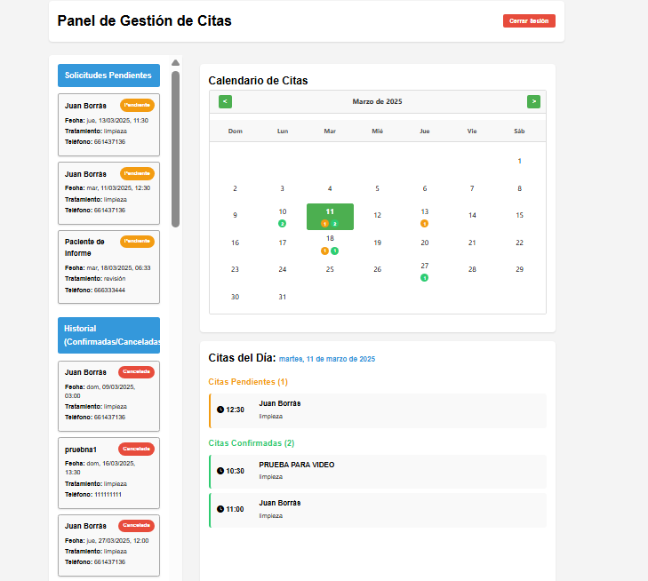
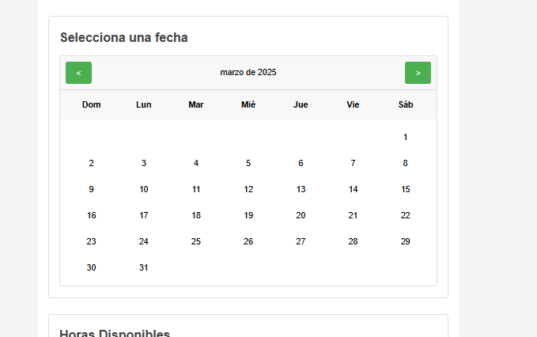
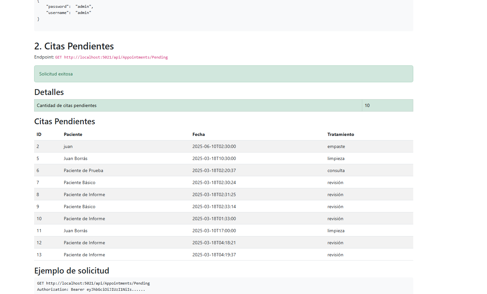

# 🦷 Clínica Dental - Sistema de Gestión de Citas

<p align="center">
  
  
  
</p>

## 📸 Capturas de Pantalla

<p align="center">
  <b>Panel de Administración</b><br>
  <br>
  <i>Panel completo con calendario, notificaciones en tiempo real y gestión de citas</i>
</p>

<p align="center">
  <b>Formulario de Reserva de Citas</b><br>
  <br>
  <i>Interfaz intuitiva para que los pacientes soliciten sus citas</i>
</p>

<p align="center">
  <b>Informe de API</b><br>
  <br>
  <i>Documentación detallada de todos los endpoints disponibles</i>
</p>

---

## 📋 Índice

1. [Inicio Rápido](#inicio-rápido)
2. [Video Demostración](#video-demostración)
3. [Introducción](#introducción)
4. [Arquitectura del Sistema](#arquitectura-del-sistema)
5. [Estructura del Proyecto](#estructura-del-proyecto)
6. [Funcionalidades Principales](#funcionalidades-principales)
   - [Comunicaciones por Sockets](#comunicaciones-por-sockets-ra3)
   - [API REST](#api-rest-ra4)
   - [Seguridad](#seguridad-ra5)
7. [Clientes Implementados](#clientes)
8. [Panel de Administración](#panel-de-administración)
9. [Persistencia e Integración con Firebase](#persistencia-e-integración-con-firebase)
10. [Tests y Pruebas Automatizadas](#tests-y-pruebas-automatizadas)
11. [Scripts de Utilidad](#scripts-de-utilidad)
12. [Ejecución del Proyecto](#ejecución-del-proyecto)
13. [Conclusiones](#conclusiones)
14. [Deudas Técnicas](#deudas-técnicas)


---

## Inicio Rápido

Para empezar a utilizar el sistema de forma rápida y sencilla, he desarrollado varios scripts de utilidad:

### Iniciar el Sistema Completo

El script principal `iniciar_clinic_app.ps1` lo hace todo por ti con un solo comando:

```powershell
.\iniciar_clinic_app.ps1
```

Este script:
1. **Detiene cualquier instancia previa** del servidor o procesos relacionados que pudieran estar ejecutándose
2. **Compila la solución completa** asegurando que todo el código esté actualizado
3. **Inicia el servidor API** en una ventana separada de PowerShell
4. **Abre automáticamente dos páginas en el navegador**:
   - El **calendario para pacientes** (http://localhost:5021/index.html)
   - El **panel de administración** (http://localhost:5021/admin/index.html)
5. Si tienes Chrome instalado, abrirá ambas páginas como pestañas en la misma ventana

> **Nota**: Para acceder al panel de administración, usa las credenciales:
> - **Usuario**: admin
> - **Contraseña**: admin

### Generar Informe de API

También puedes generar un informe detallado de la API con el script:

```powershell
.\api-report.ps1
```

Este script:
1. Verifica si el servidor está activo (aunque funciona incluso si no lo está)
2. Utiliza los scripts del directorio `report` para realizar pruebas en todos los endpoints
3. Genera un archivo HTML con información detallada sobre cada endpoint
4. Abre automáticamente el informe en tu navegador predeterminado

El informe es extremadamente útil para:
- Documentar la API completa
- Verificar qué endpoints están funcionando correctamente
- Comprobar los formatos de respuesta
- Ver ejemplos de solicitudes y respuestas

### Ejecución de pruebas completas

Si quieres ejecutar todas las pruebas del sistema:

```powershell
.\src\Tools\Scripts\run-all-tests.ps1
```

Este comando ejecutará las pruebas de API, citas y WebSockets, mostrando un informe completo de los resultados.

Estos scripts facilitan enormemente el proceso de desarrollo y pruebas, permitiendo ver todos los componentes en funcionamiento simultáneamente.

## Video Demostración

He creado un video demostrativo donde muestro el funcionamiento completo del sistema con todos los componentes interactuando en tiempo real:

[](https://youtu.be/ZDbxcKNeX9M)

### Lo que se muestra en el video:

- **Funcionamiento simultáneo** de ambos tipos de clientes:
  - Cliente para pacientes que quieren solicitar una cita
  - Panel de administración para el personal de la clínica

- **Operaciones en tiempo real**:
  - Creación de una nueva cita desde la perspectiva del paciente
  - Visualización inmediata de la cita en el panel de administración
  - Confirmación de citas pendientes por parte del personal
  - Sincronización automática entre todos los componentes

- **Replicación en Firebase**: (Esto se me ha olvidado ponerlo en el video :S)
  - Demostración de cómo los datos se actualizan instantáneamente en Firebase Realtime Database
  - Verificación de la persistencia en múltiples fuentes

- **Notificaciones**:
  - Sistema de notificaciones en tiempo real mediante WebSockets
  - Alertas visuales cuando se producen cambios en las citas

Esta demostración ilustra perfectamente cómo todos los componentes del sistema interactúan entre sí, proporcionando una experiencia fluida tanto para pacientes como para el personal de la clínica.

## Introducción

Este proyecto implementa un sistema completo para la gestión de citas en una clínica dental, cumpliendo con los siguientes resultados de aprendizaje:

- **RA3**: Programación de comunicaciones en red utilizando sockets
- **RA4**: Desarrollo de servicios en red mediante API REST
- **RA5**: Protección de aplicaciones y datos mediante técnicas de seguridad

He desarrollado esta aplicación como parte de mi aprendizaje en el módulo de Programación de Servicios y Procesos. El objetivo ha sido crear un sistema real y funcional que aplique los conceptos teóricos vistos en clase.

## Arquitectura del Sistema

- **Clientes**: Tanto web como consola, que permiten a pacientes y personal gestionar citas
- **Servidor API**: Procesa las peticiones y gestiona la lógica de negocio
- **Servidor de Notificaciones**: Envía actualizaciones en tiempo real mediante sockets
- **Almacenamiento**: Local en JSON y replicación en Firebase
- **Seguridad**: Cifrado asimétrico y registro de operaciones

## Estructura del Proyecto

El proyecto ha sido completamente estructurado siguiendo principios de arquitectura limpia y separación de responsabilidades:

```
PSEP-Proyecto/
├── report/                              # Directorio para informes generados
│   ├── api-report.html                  # Informe generado sobre los endpoints de la API
│   └── generate-api-report.ps1          # Script para generar el informe
├── src/
│   ├── Server/                          # Servidor (API, Sockets, Seguridad)
│   │   ├── API/                         # API REST (RA4)
│   │   │   ├── Controllers/             # Controladores REST
│   │   │   ├── Middleware/              # Middleware de autenticación y logging
│   │   │   └── Program.cs               # Configuración de la API
│   │   ├── Socket/                      # Servidores de Socket (RA3)
│   │   │   └── NotificationService.cs   # Servicio de notificaciones en tiempo real
│   │   ├── Security/                    # Seguridad (RA5)
│   │   │   ├── Encryption/              # Cifrado asimétrico
│   │   │   ├── Authentication/          # Autenticación JWT
│   │   │   └── Logging/                 # Registro unidireccional
│   │   ├── Data/                        # Capa de datos
│   │   │   ├── Json/                    # Almacenamiento en JSON
│   │   │   └── Firebase/                # Replicación en Firebase
│   │   └── Models/                      # Modelos de dominio
│   ├── Clients/                         # Clientes
│   │   ├── ConsoleClient/               # Cliente de consola (para monitoreo en tiempo real)
│   │   └── WebClient/                   # Cliente web (calendario y panel admin)
│   ├── Tests/                           # Tests y pruebas automatizadas
│   │   ├── API/                         # Tests de la API REST
│   │   ├── Appointments/                # Tests de funcionalidades de citas
│   │   └── WebSocket/                   # Tests de comunicación por sockets
│   ├── Tools/                           # Herramientas y utilidades
│   │   └── Scripts/                     # Scripts auxiliares para mantenimiento
│   ├── Common/                          # Código compartido
│   └── ClinicaDental.sln                # Solución completa del proyecto
├── iniciar_clinic_app.ps1               # Script principal para iniciar todos los componentes
├── api-report.ps1                       # Script para generar y abrir el informe de API
└── docs/                                # Documentación adicional
```

Esta estructura me ha permitido mantener el código organizado y facilitar la implementación de nuevas funcionalidades.

## Funcionalidades Principales

### Comunicaciones por Sockets (RA3)

En esta parte del proyecto, he implementado:

- **Servidor TCP** para notificaciones en tiempo real (puerto 11000)
- **WebSockets** para notificaciones en el navegador
- **Conexiones asíncronas** de múltiples clientes
- **Bloqueo de recursos compartidos** usando ConcurrentDictionary
- **Cifrado asimétrico** en las comunicaciones
- **Indicador visual de estado de conexión** para monitorear la comunicación WebSocket
- **Sistema robusto de procesamiento de mensajes** con manejo de diferentes formatos
- **Notificaciones visuales mejoradas** con animaciones y códigos de color

```csharp
// Intercambio de claves públicas entre cliente y servidor
private async Task HandleClientConnectionAsync(string clientId, TcpClient client)
{
    try {
        // Configurar stream para comunicación
        var netStream = client.GetStream();
        var reader = new StreamReader(netStream);
        var writer = new StreamWriter(netStream) { AutoFlush = true };
        
        // Enviar la clave pública del servidor
        var serverPublicKey = _encryptionService.GetPublicKey();
        await writer.WriteLineAsync(serverPublicKey);
        
        // Recibir la clave pública del cliente
        var clientPublicKey = await reader.ReadLineAsync();
        if (!string.IsNullOrEmpty(clientPublicKey))
        {
            _clientPublicKeys.TryAdd(clientId, clientPublicKey);
            
            // Cifrar mensajes usando la clave pública del cliente
            var encryptedMessage = _encryptionService.Encrypt(
                JsonSerializer.Serialize(welcomeNotification), clientPublicKey);
            
            await writer.WriteLineAsync(encryptedMessage);
        }
    }
    catch (Exception ex) {
        Console.Error.WriteLine($"Error con cliente {clientId}: {ex.Message}");
    }
}
```

El sistema de notificaciones permite informar en tiempo real a todos los clientes conectados cuando ocurre algún cambio en las citas, como una nueva reserva, una actualización o una cancelación. Además, cada cliente recibe sólo las notificaciones cifradas con su propia clave pública, garantizando así la confidencialidad de la información.

### API REST (RA4)

He desarrollado una API REST completa para gestionar todas las operaciones relacionadas con las citas. Esta API sigue los principios RESTful y está documentada mediante Swagger.

#### Endpoints Principales

| Método | Endpoint | Función | Autenticación |
|--------|----------|---------|--------------|
| GET | `/api/Appointments` | Obtener todas las citas | No |
| GET | `/api/Appointments/{id}` | Obtener una cita específica | No |
| POST | `/api/Appointments` | Crear una nueva cita | No |
| PUT | `/api/Appointments/{id}` | Actualizar una cita existente | No |
| DELETE | `/api/Appointments/{id}` | Eliminar una cita | No |
| GET | `/api/Appointments/Available/{date}` | Obtener horas disponibles para una fecha | No |
| POST | `/api/Auth/login` | Iniciar sesión (obtener token JWT) | No |
| POST | `/api/Auth/validate` | Validar un token JWT | No |
| GET | `/api/Staff/appointments/all` | Obtener todas las citas (staff) | Sí (JWT) |
| GET | `/api/Staff/appointments/date/{date}` | Obtener citas por fecha (staff) | Sí (JWT) |
| GET | `/api/Staff/pending` | Obtener citas pendientes (staff) | Sí (JWT) |
| PUT | `/api/Staff/appointments/{id}/status` | Actualizar estado de cita (staff) | Sí (JWT) |
| DELETE | `/api/Staff/appointments/{id}` | Rechazar/eliminar cita (staff) | Sí (JWT) |
| GET | `/api/Staff/history` | Obtener historial de solicitudes (staff) | Sí (JWT) |

A continuación muestro ejemplos del código para algunos de los endpoints más importantes:

#### Obtener Citas por Fecha (Staff)
```csharp
[HttpGet("appointments/date/{date}")]
public IActionResult GetAppointmentsByDate(string date)
{
    if (!DateTime.TryParse(date, out DateTime parsedDate))
    {
        return BadRequest(new { message = "Formato de fecha inválido. Use yyyy-MM-dd" });
    }

    var appointments = _jsonRepository.GetAllAppointments();
    var appointmentsForDate = appointments.Where(a => 
        a.AppointmentDateTime.Date == parsedDate.Date
    ).ToList();
    
    return Ok(appointmentsForDate);
}
```

#### Actualizar Estado de Cita (Confirmar/Reprogramar)
```csharp
[HttpPut("appointments/{id}/status")]
public async Task<IActionResult> UpdateAppointmentStatus(long id, [FromBody] AppointmentStatusModel model)
{
    var appointment = _jsonRepository.GetAppointment(id);
    
    if (appointment == null)
    {
        return NotFound(new { message = "Cita no encontrada" });
    }
    
    appointment.IsConfirmed = model.IsConfirmed;
    
    if (!string.IsNullOrEmpty(model.Notes))
    {
        appointment.Notes = model.Notes;
    }
    
    if (model.AppointmentDateTime.HasValue)
    {
        appointment.AppointmentDateTime = model.AppointmentDateTime.Value;
    }
    
    if (!string.IsNullOrEmpty(model.TreatmentType))
    {
        appointment.Treatment = model.TreatmentType;
    }
    
    // Actualizar en JSON local y Firebase
    _jsonRepository.UpdateAppointment(appointment);
    await _firebaseRepository.UpdateAppointmentAsync(appointment);
    
    // Registrar acción en el historial
    AppointmentHistoryItem historyItem = new AppointmentHistoryItem
    {
        AppointmentId = appointment.Id,
        PatientName = appointment.PatientName,
        Action = model.IsConfirmed ? "Aceptada" : "Reprogramada",
        Timestamp = DateTime.Now
    };
    
    _jsonRepository.AddAppointmentHistoryItem(historyItem);
    await _firebaseRepository.AddAppointmentHistoryItemAsync(historyItem);
    
    return Ok(appointment);
}
```

### Seguridad (RA5)

Para proteger la aplicación y los datos, implementé varios mecanismos de seguridad:

#### Cifrado Asimétrico RSA

Todas las comunicaciones entre el cliente de consola y el servidor de notificaciones se cifran mediante RSA:

```csharp
// Cifrado de mensaje con clave pública del cliente
public string Encrypt(string plainText, string clientPublicKeyXml)
{
    try
    {
        byte[] clientPublicKeyBytes = Convert.FromBase64String(clientPublicKeyXml);
        
        using (var clientRsa = RSA.Create())
        {
            clientRsa.ImportRSAPublicKey(clientPublicKeyBytes, out _);
            
            byte[] dataToEncrypt = Encoding.UTF8.GetBytes(plainText);
            byte[] encryptedData = clientRsa.Encrypt(dataToEncrypt, RSAEncryptionPadding.OaepSHA256);
            
            return Convert.ToBase64String(encryptedData);
        }
    }
    catch (Exception ex)
    {
        throw new CryptographicException($"Error al cifrar datos: {ex.Message}", ex);
    }
}
```

#### Autenticación JWT

El panel de administración utiliza tokens JWT para la autenticación:

```csharp
[HttpPost("login")]
public IActionResult Login([FromBody] LoginModel model)
{
    // Verificar credenciales
    if (model.Username == "admin" && model.Password == "admin")
    {
        var token = _jwtAuthService.GenerateToken("2", "Staff", "admin");
        
        return Ok(new { 
            token = token,
            username = "Administrador",
            role = "staff"
        });
    }
    
    return Unauthorized(new { message = "Usuario o contraseña incorrectos" });
}
```

#### Registro Unidireccional (WORM)

Cada operación queda registrada en un log que no puede ser alterado, garantizando así la trazabilidad de todas las acciones:

```csharp
public void AddAppointmentHistoryItem(AppointmentHistoryItem historyItem)
{
    // Obtener el historial actual
    var history = GetAppointmentHistory();
    
    // Agregar el nuevo elemento
    history.Add(historyItem);
    
    // Escribir el historial actualizado al archivo
    string historyFilePath = Path.Combine(_dataDirectory, "appointment_history.json");
    string historyJson = JsonSerializer.Serialize(history, new JsonSerializerOptions
    {
        WriteIndented = true
    });
    File.WriteAllText(historyFilePath, historyJson);
}
```

El registro unidireccional fue particularmente interesante de implementar. Cada operación queda registrada en un log que no puede ser alterado, garantizando así la trazabilidad de todas las acciones. Además, este historial se replica en Firebase para mayor seguridad.

## Clientes

### Cliente Web

He desarrollado una interfaz web moderna con:

- **Página de reserva de citas** para pacientes
- **Panel de administración** para el personal de la clínica con:
  - **Calendario visual** que muestra citas pendientes (amarillo) y confirmadas (verde)
  - **Panel lateral de solicitudes pendientes** para gestionar nuevas citas
  - **Gestión interactiva de citas** permitiendo aceptar, rechazar o reprogramar solicitudes
  - **Historial de solicitudes** que muestra todas las acciones realizadas sobre las citas
- **Notificaciones en tiempo real** vía WebSockets
- **Diseño responsive** para acceso desde cualquier dispositivo
- **Selección visual mejorada** de fechas y horas para una mejor experiencia de usuario

### Monitor de Operaciones (Cliente de Consola)

Para facilitar la supervisión del sistema, he creado un monitor de operaciones en consola que:

- Muestra en tiempo real todas las **operaciones CRUD** que ocurren en el sistema
- Proporciona información detallada sobre cada operación (creación, actualización, eliminación)
- Se conecta mediante **sockets TCP** para recibir notificaciones instantáneas
- Implementa **cifrado asimétrico** para asegurar las comunicaciones
- Sirve como herramienta de auditoría para administradores del sistema

El monitor muestra las operaciones con códigos de color para facilitar la visualización:

```csharp
private void HandleNotification(AppointmentNotification notification)
{
    // Timestamp actual
    string timestamp = DateTime.Now.ToString("yyyy-MM-dd HH:mm:ss");
    
    // Color según tipo de operación
    ConsoleColor color;
    string operationName;
    
    switch(notification.Action.ToLower())
    {
        case "created":
            color = ConsoleColor.Green;
            operationName = "CREACIÓN";
            // Mostrar detalles de la nueva cita
            break;
        
        case "updated":
            color = ConsoleColor.Yellow;
            operationName = "ACTUALIZACIÓN";
            // Mostrar detalles de la cita actualizada
            break;
        
        case "deleted":
            color = ConsoleColor.Red;
            operationName = "ELIMINACIÓN";
            // Mostrar detalles de la cita eliminada
            break;
    }
    
    // Mostrar con formato visual
    Console.ForegroundColor = color;
    Console.WriteLine($"[{timestamp}] OPERACIÓN: {operationName}");
}
```

## Panel de Administración

El panel de administración es una herramienta completa para la gestión de citas que incluye:

### Calendario Interactivo con Indicadores Visuales

El calendario muestra visualmente:
- **Círculos verdes** para días con citas confirmadas
- **Círculos amarillos** para días con citas pendientes
- **Indicadores numéricos** que muestran la cantidad de citas en cada día
- **Contraste mejorado** en todos los textos y elementos para mejor visibilidad

```javascript
// Mostrar indicadores de citas
if (confirmedCount > 0 || pendingCount > 0) {
    html += '<div class="appointment-indicators">';
    
    if (confirmedCount > 0) {
        html += `<span class="indicator confirmed" title="${confirmedCount} citas confirmadas">${confirmedCount}</span>`;
    }
    
    if (pendingCount > 0) {
        html += `<span class="indicator pending" title="${pendingCount} citas pendientes">${pendingCount}</span>`;
    }
    
    html += '</div>';
}
```

### Sistema de Notificaciones en Tiempo Real

El panel incluye un sofisticado sistema de notificaciones que:

- **Muestra un indicador de estado de conexión WebSocket** en la esquina inferior derecha:
  - **Verde**: Conexión activa
  - **Amarillo**: Reconectando
  - **Rojo**: Error de conexión
- **Proporciona notificaciones visuales** cuando se reciben actualizaciones
- **Garantiza actualizaciones automáticas** del panel cuando se crean nuevas citas desde la página principal
- **Muestra animaciones** para indicar actividad incluso cuando la consola no está visible
- **Código de colores** para diferentes tipos de notificaciones (nuevas citas, actualizaciones, etc.)

```javascript
function setupWebSocketConnection() {
    const wsProtocol = window.location.protocol === 'https:' ? 'wss:' : 'ws:';
    const wsUrl = `${wsProtocol}//${window.location.host}/ws`;
    
    // Crear conexión WebSocket
    webSocket = new WebSocket(wsUrl);
    
    // Mostrar indicador de estado
    const statusIndicator = document.getElementById('ws-status');
    
    webSocket.onopen = () => {
        console.log("WebSocket conectado");
        statusIndicator.className = 'ws-status connected';
        statusIndicator.title = 'WebSocket conectado';
    };
    
    webSocket.onclose = () => {
        console.log("WebSocket desconectado");
        statusIndicator.className = 'ws-status disconnected';
        statusIndicator.title = 'WebSocket desconectado - Reconectando...';
        
        // Intentar reconectar después de 3 segundos
        setTimeout(setupWebSocketConnection, 3000);
    };
    
    webSocket.onerror = (error) => {
        console.error("Error en WebSocket:", error);
        statusIndicator.className = 'ws-status error';
        statusIndicator.title = 'Error en la conexión WebSocket';
    };
    
    webSocket.onmessage = (event) => {
        console.log("Mensaje recibido:", event.data);
        statusIndicator.classList.add('active');
        
        // Quitar clase 'active' después de 500ms para crear efecto de parpadeo
        setTimeout(() => {
            statusIndicator.classList.remove('active');
        }, 500);
        
        try {
            // Procesar mensaje recibido
            processWebSocketNotification(event.data);
        } catch (error) {
            console.error("Error al procesar notificación:", error);
        }
    };
}
```

### Panel Lateral de Solicitudes Pendientes

Lista todas las nuevas solicitudes de citas que necesitan atención:

```javascript
function displayPendingRequests(appointments) {
    const container = document.getElementById('pendingRequests');
    container.innerHTML = '';

    // Filtrar citas pendientes (no confirmadas)
    const pendingAppointments = appointments.filter(appointment => !appointment.isConfirmed);

    if (pendingAppointments.length === 0) {
        container.innerHTML = '<p class="empty-message">No hay solicitudes pendientes</p>';
        return;
    }

    pendingAppointments.forEach(appointment => {
        const card = document.createElement('div');
        card.className = 'request-card';
        // Mostrar detalles de la cita pendiente
        card.onclick = () => openAppointmentModal(appointment);
        container.appendChild(card);
    });
}
```

### Sistema de Gestión de Citas

Permite tres acciones principales:

1. **Aceptar**: Confirma la cita y la marca en verde en el calendario
2. **Reprogramar**: Permite modificar fecha, hora, tratamiento y notas
3. **Rechazar**: Elimina la solicitud del sistema

```javascript
async function updateAppointment(action) {
    if (!currentAppointment) return;

    try {
        let endpoint;
        let method;
        
        // Configurar acción según el tipo
        if (action === 'reject') {
            endpoint = `${API_URL}/Staff/appointments/${currentAppointment.id}`;
            method = 'DELETE';
        } else {
            endpoint = `${API_URL}/Staff/appointments/${currentAppointment.id}/status`;
            method = 'PUT';
        }
        
        const response = await fetch(endpoint, {
            method: method,
            headers: {
                'Content-Type': 'application/json',
                'Authorization': `Bearer ${token}`
            },
            body: method === 'PUT' ? JSON.stringify(updatedData) : null
        });

        if (response.ok) {
            // Actualizar interfaz y mostrar notificación
        }
    } catch (error) {
        console.error('Error:', error);
    }
}
```

### Historial de Solicitudes

El historial registra todas las acciones realizadas sobre las citas y permite auditar todas las decisiones:

```javascript
function displayRequestHistory() {
    const container = document.getElementById('requestHistory');
    
    // Ordenar por fecha, más recientes primero
    requestHistory.sort((a, b) => 
        new Date(b.timestamp).getTime() - new Date(a.timestamp).getTime()
    );

    requestHistory.forEach(item => {
        const historyItem = document.createElement('div');
        let statusClass = '';
        
        // Asignar clase CSS según el tipo de acción
        switch (item.action.toLowerCase()) {
            case 'accepted': statusClass = 'accepted'; break;
            case 'rejected': statusClass = 'rejected'; break;
            case 'rescheduled': statusClass = 'rescheduled'; break;
        }
        
        historyItem.className = `history-item ${statusClass}`;
        
        // Mostrar detalles de la acción
        historyItem.innerHTML = `
            <div class="history-item-header">
                <span>${item.patientName}</span>
                <span class="history-item-date">${date.toLocaleDateString()}</span>
            </div>
            <div class="history-item-status">
                <span>Pendiente</span>
                <span class="status-arrow">→</span>
                <span>${item.action}</span>
            </div>
        `;
        
        container.appendChild(historyItem);
    });
}
```

## Persistencia e Integración con Firebase

### Almacenamiento Local en JSON

La aplicación utiliza archivos JSON para el almacenamiento principal de datos, lo que facilita la depuración y el desarrollo:

```csharp
public List<Appointment> GetAllAppointments()
{
    return LoadAppointments();
}

private List<Appointment> LoadAppointments()
{
    // Verificar si el archivo existe
    if (!File.Exists(_appointmentsFile))
    {
        // Si no existe, devolver una lista vacía
        return new List<Appointment>();
    }

    // Leer el contenido del archivo
    string json = File.ReadAllText(_appointmentsFile);
    
    // Deserializar el contenido a una lista de citas
    return JsonSerializer.Deserialize<List<Appointment>>(json) ?? new List<Appointment>();
}
```

### Replicación en Firebase

Para garantizar la disponibilidad y redundancia de los datos, implementé una replicación automática en Firebase:

```csharp
public async Task<bool> UpdateAppointmentAsync(Server.Models.Appointment appointment)
{
    try
    {
        string appointmentJson = JsonSerializer.Serialize(appointment);
        var content = new StringContent(appointmentJson, Encoding.UTF8, "application/json");
        
        // Actualizar en Firebase usando la clave específica
        var response = await _httpClient.PutAsync(
            $"{_firebaseUrl}/appointments/{appointment.FirebaseKey}.json?auth={_apiKey}", 
            content);
        
        return response.IsSuccessStatusCode;
    }
    catch (Exception ex)
    {
        Console.WriteLine($"Error al actualizar cita en Firebase: {ex.Message}");
        return false;
    }
}
```

### Sincronización de Historial

Una característica importante es la sincronización del historial de cambios entre el almacenamiento local y Firebase:

```csharp
public async Task<IActionResult> GetAppointmentHistory()
{
    // Obtener historial local
    var historyLocal = _jsonRepository.GetAppointmentHistory();
    
    // Obtener historial de Firebase
    var historyFirebase = await _firebaseRepository.GetAppointmentHistoryAsync();
    
    // Combinar ambos historiales (eliminar duplicados por ID y timestamp)
    var combinedHistory = historyLocal.ToList();
    
    foreach (var fbItem in historyFirebase)
    {
        bool isDuplicate = combinedHistory.Any(localItem =>
            localItem.AppointmentId == fbItem.AppointmentId &&
            Math.Abs((localItem.Timestamp - fbItem.Timestamp).TotalSeconds) < 5
        );
        
        if (!isDuplicate)
        {
            combinedHistory.Add(fbItem);
        }
    }
    
    // Ordenar por timestamp descendente (más recientes primero)
    var sortedHistory = combinedHistory.OrderByDescending(item => item.Timestamp).ToList();
    
    return Ok(sortedHistory);
}
```

Esta sincronización garantiza que, incluso si hay problemas de conexión, los datos eventualmente se sincronizarán cuando la conexión se restablezca.

## Tests y Pruebas Automatizadas

He desarrollado un conjunto completo de pruebas automatizadas para verificar el correcto funcionamiento de todos los componentes del sistema:

### Tests de API

En el directorio `src/Tests/API` se encuentran scripts de prueba para verificar el funcionamiento de la API REST:

- **test-api-complete.ps1**: Prueba exhaustiva de todos los endpoints de la API
- **test-api-simple.ps1**: Prueba básica de los endpoints principales
- **test-model.ps1**: Verifica la integridad de los modelos de datos
- **test-login.ps1**: Prueba específica para la autenticación
- **test-api-admin.ps1**: Verifica los endpoints del panel de administración

Estos tests validan la correcta respuesta de los endpoints, los códigos de estado HTTP, y la estructura de los datos devueltos.

### Tests de Citas

En el directorio `src/Tests/Appointments` hay scripts específicos para probar las funcionalidades relacionadas con citas:

- **test-create-appointment.ps1**: Verifica la creación de citas
- **test-cancel-appointment.ps1**: Prueba el proceso de cancelación de citas
- **test-confirm-appointment.ps1**: Verifica la confirmación de citas
- **test-history.ps1**: Comprueba el registro de historial de operaciones
- **test-pending.ps1**: Verifica el listado de citas pendientes

Estos tests simulan los flujos completos de operaciones para asegurar que todo el proceso funciona correctamente, desde la creación hasta la cancelación o confirmación de las citas.

### Tests de WebSockets

En `src/Tests/WebSocket` se encuentran las pruebas relacionadas con la comunicación en tiempo real:

- **test-websocket.ps1**: Prueba completa del sistema de notificaciones por WebSockets
- **test-websocket-simple.ps1**: Versión simplificada para tests rápidos

Estos tests establecen conexiones con el servicio de notificaciones y verifican que las notificaciones se envíen correctamente cuando ocurren cambios en las citas.

### Ejecución de Pruebas

Todas las pruebas pueden ejecutarse de forma individual o utilizando el script centralizado:

```powershell
# Ejecutar todas las pruebas
.\src\Tools\Scripts\run-all-tests.ps1

# Ejecutar una prueba específica
.\src\Tests\API\test-api-complete.ps1
```

Los resultados de las pruebas se muestran en la consola, indicando cuáles han pasado y cuáles han fallado, facilitando así la identificación y corrección de errores.

## Scripts de Utilidad

He desarrollado varios scripts útiles para facilitar el desarrollo, pruebas y uso del sistema:

### Scripts en la Raíz del Proyecto

- **iniciar_clinic_app.ps1**: Script principal que inicia todos los componentes del sistema
- **api-report.ps1**: Genera y abre automáticamente un informe detallado de la API

### Scripts de Generación de Informes

En el directorio `report` y `src/Tools/Scripts`:

- **generate-api-report.ps1**: Genera un informe HTML completo de todos los endpoints de la API
- **generate-and-open-report.ps1**: Genera el informe y lo abre automáticamente en el navegador
- **open-report.ps1**: Simplemente abre un informe ya generado

### Scripts de Mantenimiento

En el directorio `src/Tools/Scripts`:

- **forzar-eliminacion.ps1**: Herramienta para forzar la eliminación de citas en caso de errores
- **borrado-extremo.ps1**: Limpia completamente la base de datos para pruebas de inicio limpio
- **run-all-tests.ps1**: Ejecuta todas las pruebas automatizadas en secuencia

Estos scripts facilitan enormemente el trabajo diario con la aplicación, automatizando tareas comunes y proporcionando herramientas para situaciones específicas.

> 📝 **Nota**: Para documentación detallada sobre todas las herramientas y scripts, consulta [docs/herramientas.md](docs/herramientas.md).

## Ejecución del Proyecto

Para ejecutar todos los componentes del sistema fácilmente, utilice el script incluido:

```bash
.\iniciar_clinic_app.ps1
```

Este script realiza las siguientes operaciones:
- **Compila la solución completa** para asegurar que todos los componentes están actualizados
- **Inicia el servidor API** en una ventana separada de PowerShell
- **Abre automáticamente el calendario para pacientes** en el navegador (http://localhost:5021/index.html)
- **Abre el panel de administración** en otra pestaña (http://localhost:5021/admin/index.html)
- **Muestra información útil** sobre las URLs disponibles y credenciales

### Credenciales por defecto
Para acceder al panel de administración, use:
- **Usuario**: admin
- **Contraseña**: admin

### Generación de informes

Para generar un informe completo sobre la API:

```bash
.\api-report.ps1
```

Este comando generará un informe HTML detallado de la API y lo abrirá automáticamente en su navegador predeterminado.

### Ejecución individual de componentes

Si desea ejecutar los componentes por separado:

#### Servidor API
```bash
cd src/Server/API
dotnet run
```

#### Monitor de Operaciones
```bash
cd src/Clients/ConsoleClient
dotnet run
```

#### Ejecutar pruebas
```bash
cd src/Tools/Scripts
.\run-all-tests.ps1
```


## Conclusiones

Este proyecto ha sido un gran desafío que me ha permitido aplicar los conocimientos adquiridos en el módulo. He aprendido mucho sobre:

- **Arquitectura de aplicaciones distribuidas**: La separación en capas y componentes ha sido fundamental
- **Comunicación asíncrona**: Manejar múltiples clientes simultáneamente requiere un enfoque diferente
- **Seguridad en aplicaciones**: El cifrado y la auditoría son esenciales para proteger datos sensibles
- **Integración con servicios en la nube**: Firebase ofrece grandes posibilidades para aplicaciones modernas

Al desarrollar este proyecto, me di cuenta de la importancia de planificar bien la arquitectura antes de comenzar a programar. También comprendí que hay un equilibrio entre seguridad, usabilidad y rendimiento que siempre hay que tener en cuenta.

## Deudas Técnicas

Aunque estoy satisfecho con el resultado, hay aspectos que podrían mejorarse en futuras versiones:

1. **Escalabilidad**: El servidor actual podría tener limitaciones con muchos clientes
2. **Pruebas automatizadas**: A pesar de tener muchas pruebas, aún faltan tests unitarios más específicos
3. **Gestión de errores**: Podría ser más robusta en algunos componentes
4. **UI/UX**: La interfaz de usuario podría mejorar con más feedback visual
5. **Offline mode**: Sería útil que el cliente web funcionara sin conexión
6. **Containerización**: La aplicación se beneficiaría de estar en contenedores Docker
7. **CI/CD**: Implementar un pipeline de integración continua para pruebas automáticas

Estas "deudas técnicas" son oportunidades de mejora que tengo identificadas para futuras iteraciones del proyecto.
